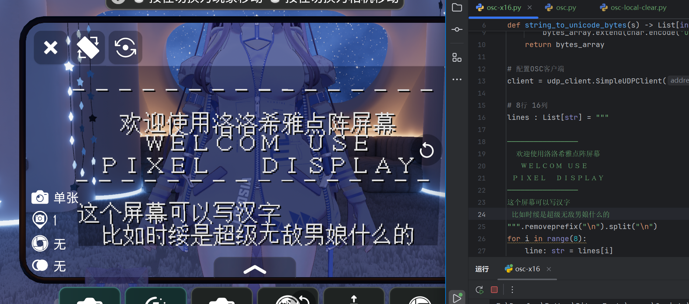
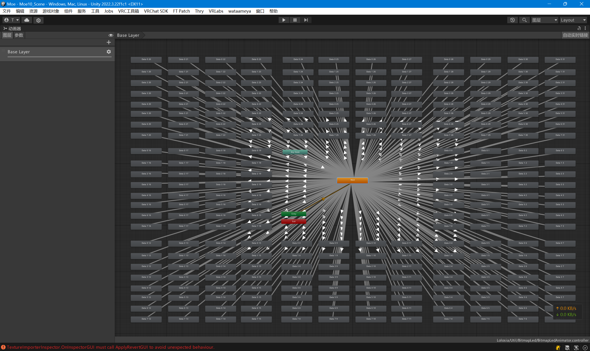
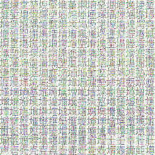

# BitmapLED-VRC点阵屏幕

## 概述
该项目用于在VRChat中绘制一个点阵屏幕。  
- 使用OSC进行控制。  
- 有 17 bit 和 25 bit 两种同步参数版本可选。  
- 默认大小为 16x8 字符，最大显示256个汉字，支持U+0000 ~ U+FFFF。  
- 显存占用 2.4 MB。  
- <del>十分卡顿，能从80帧掉到40帧</del>

## 效果展示


## 如何修改
字符类型为 UTF-16 BE， 当前支持对256个字节进行寻址，以下为修改方式：  

设置修改参数所需的地址索引。
```plaintext
/avatar/parameters/BitmapLed/Pointer
```

17 bits 版本需要设置的参数
```plaintext
/avatar/parameters/BitmapLed/Data
```

25 bits 版本需要设置的参数

```plaintext
# 高八位
/avatar/parameters/BitmapLed/DataX16
# 低八位
/avatar/parameters/BitmapLed/Data
```

## 部分原理

### 减少同步参数
该项目使用一个动画层对Pointer指向的256个不同的非同步参数进行拷贝，以减少同步参数占用。


### 字体库

RGBA32图像中每个色彩通道里面每个颜色是8bit，这样我们可以将8张图对应的像素合并到这一个像素内，
然后由于RGBA有四个通道，且每个通道能塞8张，结果就是我们可以把32张黑白图像合并到1张贴图内。  

示例：  
